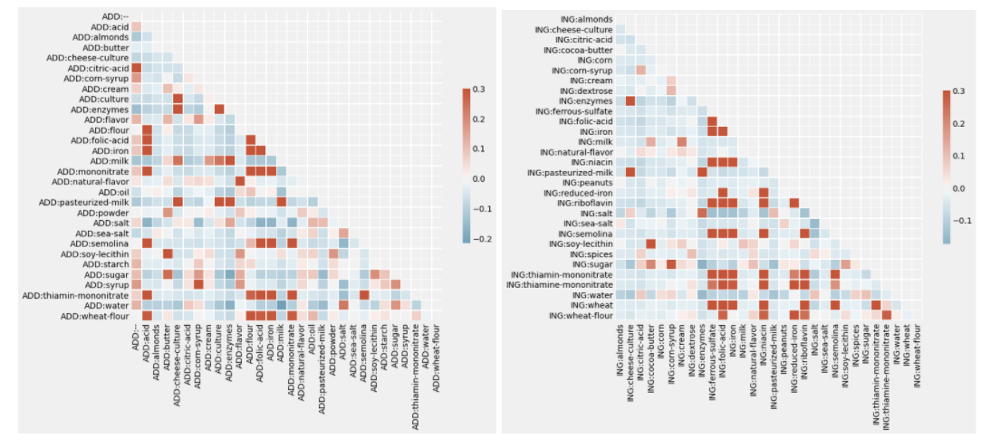

### Authors: Man Chong Chan (mcchan3), Samuel Guo (sguo), Gabe Taylor (gabet2)

### Team Leader: Gabe Taylor (gabet2)

### Spring 2021

GitHub Repository: https://github.com/gabet2/STAT542 

## Project Description and Summary

The goal of this project is two-fold: unsupervised and supervised learning on french market food products. The unsupervised task was aimed at extracting meaningful groups of similar ingredients via clustering on the macronutrient profiles of the food products. We approached this task by first performing conventional text processing on the ingredients, such as removing non-english ingredients, whitespace, superfluous characters, and hyphenating natural pairs of words. Next, we created a master dictionary of the 1000 most frequently occurring ingredients, and excluded any products containing ingredients not found in the master dictionary. After cleaning the text, we moved onto processing the macronutrients, which involved removing outliers, centering, and scaling. Finally, we performed K-means clustering, hierarchical clustering, and generated self-organizing maps. All three methods yielded congruent clusters of macronutrients, which each housed intuitive groups of frequently occurring ingredients, such as a nut dominant cluster and a dairy dominant cluster. 

After obtaining promising results from the unsupervised portion, we turned to the supervised task, which involved both a classification and regression component. Our goal was to reliably predict the nutrition score of a food product given only the list of ingredients and additives. We used the same text cleaning techniques for both the ingredients and additives column as in the unsupervised task. Next, we converted both columns into document term matrices using TF-IDF to more accurately represent the prevalence of the ingredients and additives. After concatenating the respective matrices, given a large linear dependency of the additives on the ingredients, we performed truncated SVD for dimensionality reduction, which yielded our final design matrix containing 30 features. To perform the classification task, we split the target at the median value in effort to separate “healthy” products from “unhealthy” products. We considered 3 algorithms for this task, including Logistic Regression with the L1 penalty, Random Forest, and XGBoost. All algorithms were tuned using a random grid search with cross-validation on the training set. XGBoost resulted in the highest accuracy of 89% on the training set, and 85% on the test set. We had a similar approach for the regression task, which aimed to directly predict the exact nutrition score of a food product. Again, all three algorithms, which included LASSO, Random Forest, and XGBoost were tuned via random grid search with cross-validation on the training set. XGBoost resulted in the lowest RMSE of 4.13 on the training set and 4.81 on the test set. 

We successfully identified meaningful groups of similar ingredients via clustering on the macronutrient profiles of food products in the french market using K-means clustering, hierarchical clustering, and self-organizing maps. In addition, we not only demonstrated that we can successfully separate healthy food products from unhealthy food products using only the list of ingredients, but we can also reliably predict the exact nutrition score of a product within 4-5 points on average. 

## Literature Review

### OpenFoodFacts

[Food additives: distribution and co-occurrence in 126,000 food products of the French market](https://www.nature.com/articles/s41598-020-60948-w.pdf)

In recent decades, the consumption of foods undergoing physical, biological, and/or chemical changes and containing various additives has increased greatly. While some are harmless or perhaps even beneficial, others may be nutritionally poor and have been linked to negative health outcomes. Thus, it will be helpful to study which additives are most common and which foods are most likely to contain additives.

In this study, the goal was to determine distribution and co-occurence of the over 330 food additives authorized in Europe. Clustering analysis was performed on the ingredient lists of over 126,000 French foods and beverages, retrieved from Open Food Facts. They identified a total of 35 different food categories to be used in their analysis. 

To measure food additive distribution, they calculated the percentages of total food items each category represented, percentages of the items of each category which contained some number of additives (overall and by category), and many products each additive appears in. 

To measure food additive co-occurrence, each food product was represented with a binary vector that encoded the presence/absence of each additive. Only 141 of the additives were considered, as the others occurred too infrequently. Discrete ordinal variables used/developed by various European governments or outside food researchers to indicate the nutritional quality and degree of processing of the food products were also included. These features were then clustered using an agglomerative hierarchical clustering algorithm. They were then validated and visualized with a network analysis.

It was found that overall, over half of all the food products contained additives. A large proportion of sweetened beverages, desserts, pastries, and sandwiches contained at least one additive. The most frequently used additives were citric acid, lecithins and modified starches. The final clustering results yielded 6 clusters, and the specific additives belonging to each were also identified; the clusters represented dyes/glazing agents, additives for sandwiches and desserts, stabilizers/emulsifiers for pastries, sweeteners for gum and beverages, flavor enhancers, and preservatives/antioxidants mostly found in meats. 

[Discriminating nutritional quality of foods using the 5-Color nutrition label in the French food market: consistency with nutritional recommendations](https://link.springer.com/content/pdf/10.1186/s12937-015-0090-4.pdf)

The study aims to assess the performance of the 5-Colour nutrition label (5-CNL) front-of-pack nutrition label based on the Food Standards Agency nutrient profiling system to discriminate nutritional quality of foods currently on the market in France and its consistency with French nutritional recommendations. 7777 foods available on the French market were collected from the “open foods facts” dataset. Distribution of similar products from different brands in the 5-CNL categories was also assessed. Discriminating performance was considered as the number of color categories present in each food group.

The main food groups included ‘Fruit and Vegetables’, ‘Cereals and potatoes’, ‘Meat, Fish and Eggs’, ‘Dairy products and fresh desserts’, ‘Fats and sauces’, ‘Composite dishes, ‘Sugary snacks’, ‘Salty snacks’ and ‘Beverages’. Based on previous research conducted from the food composition table of the Nutrinet-Santé study, which contains foods usually consumed in France, as follows from higher nutritional quality to lower nutritional quality: ‘Green’ (−15 to −2), ‘Yellow’ (−1 to 3), ‘Orange’ (4 to 11), ‘Pink’ (12 to 16) and ‘Red’ (17 and above). 

The study shows that the 5-CNL, based on an amended FSA score allows to discriminate across food groups, within food groups and for similar products across different brands, for foods products and beverages currently available on the French market. Overall, classification of products according to the 5-CNL was consistent with nutritional recommendations: 95.4 % of ‘Fruits and vegetables’, 72.5 % of ‘Cereals and potatoes’ were classified as ‘Green’ or ‘Yellow’ whereas 86.0 % of ‘Sugary snacks’ were classified as ‘Pink’ or ‘Red’. The 5-CNL would allow consumers to make healthier choices at the point of purchase.

### Text Analysis 

[Using TF-IDF to Determine Word Relevance in Document Queries](https://citeseerx.ist.psu.edu/viewdoc/download?doi=10.1.1.121.1424&rep=rep1&type=pdf) 

The study examines the results of applying Term Frequency Inverse Document Frequency (TF-IDF) to determine what words in a corpus of documents might be more favorable to use in a query. TF-IDF calculates values for each word in a document through an inverse proportion of the frequency of the word in a particular document to the percentage of documents the word appears in. Words with high TF-IDF numbers imply a strong relationship with the document they appear in, suggesting that if that word were to appear in a query, the document could be of interest to the user. 
TF-IDF is defined as below:

Note:
 is the frequency of term inside the document;  is the total number of words in the document.
 is the total number of documents in the corpus ;  is the number of documents where the term appears.

TF-IDF is an efficient and simple algorithm for matching words in a query to documents that are relevant to that query. The study showed that TF-IDF returns documents that are highly relevant to a particular query. If a user were to input a query for a particular topic, TF-IDF can find documents that contain relevant information on the query. Furthermore, encoding TF-IDF is straightforward, making it ideal for forming the basis for more complicated algorithms and query retrieval systems (Berger et al, 2000).  However, TF-IDF has its own limitations, it was not able to properly deal with synonyms and plural forms of some words in the study.

In our project, we utilized Tf-Idf of the ingredients text in the Supervised Learning task.

[The influence of preprocessing on text classification using a bag-of-words representation](https://journals.plos.org/plosone/article?id=10.1371/journal.pone.0232525)

The study examines how applying various text preprocessing techniques can improve text classification. These include converting all text to lowercase, removing stop-words and extraneous characters, correcting spelling mistakes, and stemming and lemmatization, most of which are self-explanatory and trivial to implement. Stemming and lemmatization both aim to reduce inflected words to their base form, thus combining words that have the same meaning and reducing the vocabulary. Stemming simply truncates words at suffixes so it can lead to errors, whereas lemmatization is more complex and can account for context.

The study found that these techniques overall can improve the quality of the extracted features and also the performance of subsequent classification models when testing on several benchmark datasets. However, there are some cases where the effect can be detrimental. For example, the removal of stop-words can alter the resulting TF-IDF features, erroneously boosting term frequencies.

We apply some of these techniques, such as lowercase conversion, stopword removal, and punctuation removal when generating our text features. The bag-of-words representation, also known as count vectorization, is one method of feature extraction in addition to Tf-Idf we used in the supervised learning portion of this project.

## Data Processing and Summary Statistics

Given that the ingredients of the food products are the center of this project, our data processing started with cleaning the ingredients column. This was accomplished by lowercase conversion, decorator removal (i.e. accents, tildes, etc.), and punctuation removal (i.e. periods and parentheses). Next, hyphenated tokens (for example, “soy-lecithin”) were treated as single terms in the vocabulary rather than multiple. An example of a cleaned ingredients list is given below:
- Pre-cleaned: “Bananas, vegetable oil (coconut oil, corn oil and/or palm oil) sugar, natural banana flavor.”
- Post-cleaned: “bananas vegetable-oil coconut-oil corn-oil-and/or-palm-oil sugar natural-banana-flavor”

After cleaning the text in the ingredients column, we compiled a master dictionary of the 1000 most frequently occurring ingredients, and removed any food products that contained ingredients not included in the master dictionary. While this action resulted in 97% reduction in rows (356,027 to 12,277), we still retain 63% of the ingredients by frequency. Below, we plot the distribution of the frequency of the top 100 ingredients, where salt, sugar, and water alone make up a little over 8% of all ingredients. 

Next, we turned to processing the macronutrient columns, including carbohydrates, fat, and protein. In addition to total carbohydrates, we include fiber and sugar to further inform the specific carbohydrate profile of a product. This reasoning is motivated by the fact that two foods having equal total carbohydrates content can be categorized as healthy or unhealthy given the fiber and sugar content, where the lower sugar and higher fiber food will be given a healthier nutrition score. Similarly, we include the saturated fat column to further inform the fat profile of a product, where two foods having equal total fat, the food with lower saturated fat will have a better nutrition score. In total, we selected 6 nutrient columns: carbohydrates, fiber, sugar, fat, saturated fat, and protein. To process these columns, we address outliers by removing any rows containing an entry further than 3 standard deviations from the respective mean for any nutrient. Next, we centered and scaled each nutrient. 

We joined the additives column and nutrition score back onto the cleaned ingredients and macronutrients data. Finally, we dropped any rows containing missing values, which resulted in a final row count of 12,222. We cleaned the additives column using the exact techniques described in cleaning the ingredients. For the supervised task, we omitted the macronutrients and focused only on the ingredients and additives columns. In order to engineer features from the ingredients and additives, we performed a ‘bag-of-words’ transformation to represent the text as fixed length vectors with numeric entries, rendering the ingredients and additives amenable for learning. However, recall that we selected 1000 ingredients, which would yield 1000 features each for the ingredients and additives. This scale is beyond the scope of the project, and furthermore, 1000 features are most likely beyond a point of diminishing returns for predictive power. Hence, we adopt an ‘occam’s razor’ and select only 30 features for a more parsimonious model structure. The 30 chosen features are those with highest term frequency defined using TF-IDF across all food products. Below are correlation heatmaps for the 30 chosen features from both the ingredients and additives columns, each prefixed with “ING:” and “ADD:” respectively. Note that “ADD:--” is ultimately excluded from the model, because we know a priori it will not offer any significant predictive value. 
 

 
The next preprocessing step we performed is dimensionality reduction, which is motivated by the significant overlap in content between ingredients and additives. Instead of PCA, we opt for truncated SVD, which is similar to PCA, but is preferred over PCA for text features processed with methods such as TF-IDF. In selecting the top 30 components out of 59, we still preserve 96.5% of the variance, which is unsurprising given the strong linear dependency stated previously. 

Finally, with our 30 chosen features, we split our data into training (85%) and testing (15%) sets. For hyperparameter tuning, we perform cross-validation with our training set, which means that the validation folds stem from the training set. Given that we consider both a classification and regression task, we have to engineer our target appropriately. For the classification task, we split the target at the median for a balanced class structure. Additionally, despite the ordinal structure of the target, we treat the target as continuous in the regression case in effort to produce a more precise nutrition score for each prediction. 

## Unsupervised Learning

**Research Objective**:
Cluster different food products based on their macronutrient profiles and try to identify the prevalent ingredients of each food cluster.

**Self Organizing Map**:   

The clustering of Self Organizing Map preserves the underlying geometric structure between data, and the feature grid maps could potentially tell us about the relationship between different features in a cluster. Looking at the fiber, protein, fat, saturated-fat grid map, we can see that the group of data around the upper-right corner of the map tend to have high fiber, proteins, fat and saturated-fat. This suggests that fiber, protein, fat and saturated fat are somewhat proportionally correlated. Therefore, we might see cluster(s) of data that possess high fiber, protein, fat and saturated fat.

Similarly, if we look at the carbohydrates and the sugars grid map, we can see that the group of data in the lower-right corner seem to have both high carbohydrates and sugars; the group of data in the upper-left corner seem to have high carbohydrates but low sugars. This indicates that there might exist two clusters of data with high carbohydrates. One of them has high sugars while the other is more related to fiber and protein.

**K-means**:                              	
				
Use the Elbow Method to determine the number of clusters in the data.

There is a small elbow at k = 5, suggesting that we should try k = 5 for our K-means algorithm.

Five most frequent ingredients in each of the K-means clusters were extracted and the result is as follows.

**Cluster 1**:
The most frequent ingredients are citric-acid, corn-syrup, milk, ascorbic-
acid and green-beans. This cluster is characterized by a more balanced 
macronutrients profile: every nutrient is below 0, with fiber and sugar
being relatively higher. This is considered to be the “healthier” cluster.     	 

**Cluster 2**:								           
The most frequent ingredients are enzymes, pasteurized-milk, cheese-
Culture and pasteurized-part-skim-milk. This cluster is characterized by 
high proteins, fat and saturated-fat. The box plot indicates that there is a
proportional relationship between proteins, fat and saturated-fat, which agrees with one of the findings of SOM. This cluster is believed to be mostly dairy products. 

**Cluster 3**:							                    
The most frequent ingredients are almonds, peanuts, pecans, peanut-oil and 
Walnuts. This cluster is characterized by high fiber, proteins, fat and 
moderate saturated-fat, which also corresponds to one of our finding in 
SOM. This cluster seems to contain mostly nuts.

**Cluster 4**:
 The most frequent ingredients are niacin, riboflavin, folic-acid, iron and 
ferrous-sulfate. This cluster is characterized by high carbohydrates and 
moderate proteins. All the ingredients can be commonly found in Pasta, so
we believe that this cluster mainly consists of pasta and wheat products.

**Cluster 5**:								      
The most frequent ingredient are corn-syrup, soy-lecithin, cocoa-butter, 
citric-acid and chocolate-liquor. This cluster is characterized by high 
carbohydrate, sugar and moderate fiber, fat and saturated-fat. The box plot indicates that there is a proportional relationship between carbohydrate and 
sugar, which agrees with one of the findings of SOM. Judging by 
its frequent ingredients, we believe this cluster contains mostly desserts
and pastries.

**Hierarchical Clustering (Ward’s linkage)**: 	
   	       
Dendrogram of Foods on Macronutrient 

n = 5 seems to be a reasonable cutoff according to the Dendrogram

Similar to K-means, five most frequent ingredients in each of the clusters were extracted and the result is as follows.

**Cluster 1**:								     
The most frequent ingredient are corn-syrup, soy-lecithin, cocoa-butter, 
citric-acid and chocolate-liquor. This cluster is characterized by high 
carbohydrate, sugar and moderate fiber, fat and saturated-fat. This cluster corresponds to Cluster 5 in the K-means clustering. Similarly to Cluster 5
in K-means this cluster contains mostly desserts and pastries.

**Cluster 2**:								     
The most frequent ingredients are almonds, peanuts, pecans, peanut-oil 
and walnuts. This cluster is characterized by high fiber, proteins, fat and 
moderate saturated-fat, This corresponds to Cluster 3 in the 
K-means clustering, and they contain mainly nuts.

**Cluster 3**:								     
The most frequent ingredients are citric-acid, corn-syrup, milk, vitamin-d3
and green-beans. This cluster is characterized by a more balanced 
macronutrients profile. This corresponds to Cluster 1 in the 
K-means clustering: the “healthier” cluster. 

**Cluster 4**:								     
The most frequent ingredients are enzymes, pasteurized-milk, cheese-
culture and pasteurized-part-skim-milk. This cluster is characterized by 
high proteins, fat and saturated-fat. This corresponds to Cluster 2 in the K-means clustering, and mostly consists of dairy products.

**Cluster 5**:								     
 The most frequent ingredients are niacin,  folic-acid, riboflavin, iron and 
ferrous-sulfate. This cluster is characterized by high carbohydrates,
moderate proteins and fiber. This corresponds to Cluster 4 in the K-means 
clustering: pasta and wheat products cluster.

**Unsupervised Learning Conclusion**:

Of all the foods we selected, we successfully identified meaningful and congruent clustering using K-means and hierarchical clustering, and the result is also consistent with the findings of Self Organizing Map (SOM). There are five food clusters in total and each has its unique macronutrient characteristics. We then extracted the five most frequent ingredients in each cluster to identify their hypothetical dominant food type. Cluster 1, which is characterized by a relatively balanced macronutrients profile, does not exist any significant dominant food type; Cluster 2, which is characterized by high proteins, fat and saturated-fat, is believed to contain mostly dairy products; Cluster 3, which is characterized by high fiber, proteins, fat and moderate saturated-fat, is believed to be a nuts-dominant group; Cluster 4, which is characterized by high carbohydrates and moderate proteins, is believed to mainly consist of pasta and wheat products. Cluster 5, which is characterized by high carbohydrate, sugar and moderate fiber, fat and saturated-fat, is believed to be mainly desserts and pastries. With this information, we can help consumers to better understand the different macronutrient profiles between different food types and also recognize the prevalent ingredients of each food type.

## Supervised Learning

**Feature Extraction**
We used the same dataset as above. Our response variable is nutrition-score-fr_100g and the text attributes we considered were additives and ingredients_text. We extracted feature vectors using some of the methods discussed in the literature review section. 

First, the text was cleaned using lowercase conversion, decorator removal (i.e. accents, tildes, etc.), and punctuation removal (i.e. periods and parentheses). We deemed stemming and lemmatization unnecessary because the text attributes were primarily just lists of things rather than actual sentences, and did not contain significant amounts of inflected words. We defined a list of stop-words . Finally, hyphenated tokens (for example, “soy-lecithin”) were treated as single terms in the vocabulary rather than multiple. Some of these methods were performed manually, and some were handled automatically by the tools in sklearn. After cleaning, we generated features using TF-IDF. 

Because the resulting vocabulary ends up extremely large, we limit the feature vector to only include the 30 most frequently appearing terms for each of additives and ingredients_text. Features for each text attribute are extracted independently and simply concatenated afterward; additives are prefixed by “ADD:” and ingredients are prefixed by “ING:”. One feature, “ADD:--” is thrown out because it is obviously a garbage feature that perhaps arises since we did not split tokens on hyphens.

We also notice that there is a large amount of overlap between the additive terms and ingredient terms; things that appear in one text attribute are likely to appear in both. This leads to the issue of multicollinearity in the duplicated additive and ingredient features. We address this by applying Latent Semantic Analysis, which is a Truncated SVD operation meant for dimensionality reduction much like PCA. The difference is that LSA does not center the data beforehand and is intended to be used on text features like count or TF-IDF vectors. We use the first 30 LSA components, which still preserve ~96.5% of the variance.

We used a test sample split of 15%. This results in 10388 training observations and 1834 testing observations, each with our reduced 30 attributes.

To tune hyperparameters, we use cross-validation. Since some of the models have multiple such hyperparameters, we try a number of random combinations with each hyperparameter in a specified range and distribution, rather than a costly grid-search.

### Regression Models
Using our generated features, we ran several regression models to predict nutrition-score-fr_100g. From the following source, we have the following information regarding this variable: 
*"Briefly, the FSA score was computed for each food and beverage on the basis of the nutrient content per 100 g. Positive points (0 to +10) are allocated for the content of energy (kJ), SFA (g), total sugar (g), and sodium (mg), while negative points (0 to −5) are allocated for the content of fruits/vegetables/nuts (g), dietary fiber (g), and protein (g). Scores for foods and beverages are thus based on a discrete continuous scale theoretically ranging from −15 (most healthy) to +40 (least healthy)"*
We chose the models below primarily because of their capabilities for automatic variable selection. 
The primary metric was RMSE; for reference, the baseline of the mean-model (no attributes used) is 9.519.

**LASSO**:
We tune the α hyperparameter with cross validation. 
The resulting optimal values of the hyperparameter and evaluation metrics are shown below.

|Alpha|Train RMSE| Test RMSE|
|-----|----------|----------|
|0.06024| 6.225 |6.001|

**Random Forest Regressor** 
The Random Forest Regressors have several hyperparameters, which we again tune with cross validation.
These hyperparameters are:
- n_estimators: the number of trees in the forest
- max_depth: the maximum depth of each tree
- min_samples_split: the minimum number of samples in a node for a split to be performed
- min_samples_leaf: the minimum number of samples in a node for it to be considered a leaf
Optimal splits are determined with MSE and individual tree predictions are computed by averaging at leaves.

The resulting optimal values of the hyperparameter and evaluation metrics are shown below.

|n_estimators|max_depth|min_samples_split|min_samples_leaf| Train RMSE | Test RMSE|
|------------|---------|-----------------|-----------------|-----------|-----------|
|702| 9 |2|5|4.677|4.996|

**Boosting (xgboost Regressor)**
The xgboost regressors have several hyperparameters, which we again tune with cross validation. We use decision trees as the base learners. The hyperparameters are:
- eta: the shrinkage applied to the step-size, meant to reduce overfitting
- n_estimators: the total number of base learners
- max_depth: the maximum depth of each base learner decision tree

The resulting optimal values of the hyperparameter and evaluation metrics are shown below.

|eta|n_estimators|max_depth| Train RMSE | Test RMSE|
|------------|---------|-----------------|-----------|-----------|
|0.0555| 277|8|4.133|4.805|

**Regression Residual Plots**
We also examine the residual plots for both the training and testing datasets.

The residual plots of the three models appear to have approximately the same shape. The residual values do appear to be consistently centered around zero, however their variance is much higher in the middle range of fitted values (5 to 15), and the variance tapers significantly towards the edges (-5 and 25). 
Because the xgboost regressor has the lowest testing RMSE, we deem it as the best model. 

### Classification Models:

We then attempted a classification task. We assigned a class label new_score to each observation; it takes the value of 0 if the nutrition-score-fr_100g is less than or equal to 6.0, 1 otherwise. We chose this cutoff to generate classes that were approximately balanced at half the total dataset each and avoid skew.  
The classification models we used were logistic regression, random forest classifier, and xgboost classifier.
Our primary metric was accuracy.

**Logistic Regression**
We run logistic regression with an L1 regularization. The hyperparameter we tuned was C, the constant coefficient of the L1 norm penalization.

Optimal hyperparameters and metrics:

|C|Train Accuracy| Test Accuracy|
|-----|----------|----------|
|0.06024| 81.65% |80.70%|

**Random Forest Classifier**
The Random Forest Classifier is essentially the exact same model structure as the regression case, with the exception that the criterion for determining optimal splits is the Gini Impurity.

Optimal hyperparameters and metrics:

|n_estimators|max_depth|min_samples_split|min_samples_leaf| Train RMSE | Test RMSE|
|------------|---------|-----------------|-----------------|-----------|-----------|
|702| 9 |5|2|88.28%|85.28%|

**Boosting (xgboost Classifier)**
The xgboost Classifier is essentially the same model structure as the regression case.

Optimal hyperparameters and metrics:

|eta|n_estimators|max_depth| Train RMSE | Test RMSE|
|------------|---------|-----------------|-----------|-----------|
|0.0555| 277|8|89.50%|85.67%|

Classification ROC Curves

The ROC curves for each of the models all look quite good, as they all have high AUC (area under curve). Logistic regression has the weakest performance and xgboost narrowly edges out Random Forest to be the best model.

